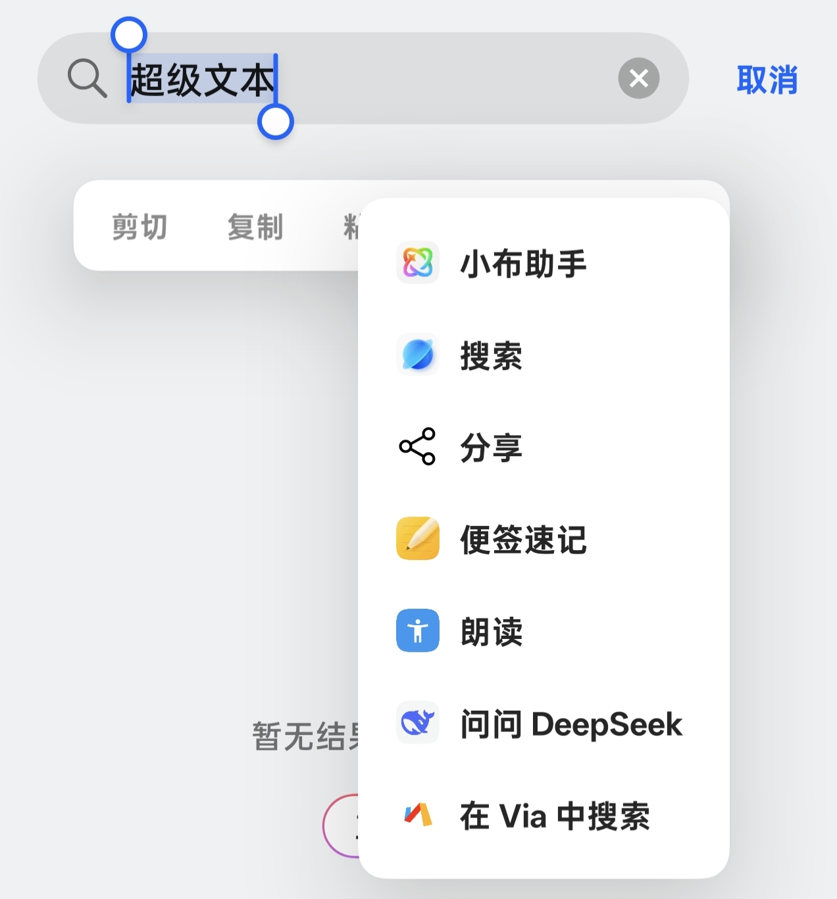
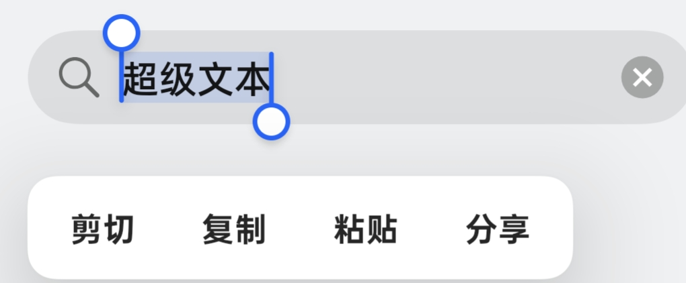

# 管理文本选择菜单-面向 ColorOS 16 的 文本菜单控制模块

**ColorOS 16 的文字选择菜单控制模块**

当前稳定版本：`v0.4.0`

[下载模块](https://github.com/TheKingBucket001/txtoi/releases/latest) · [源代码](https://github.com/TheKingBucket001/txtoi) · [问题反馈](https://github.com/TheKingBucket001/txtoi/issues)

> LSPosed 镜像仓库。GitHub 源库：[TheKingBucket001/txtoi](https://github.com/TheKingBucket001/txtoi)

---

## 项目简介

长按文字时，菜单里常会堆进一串用不到的“处理文本”项目。文本选择菜单控制把这些项目集中列出：勾选后隐藏，需要时再一键恢复。

模块只处理文字选择菜单中的扩展项，不读取选中文字，也不修改系统 APK 或其他应用。

## 效果对比

<table>
  <tr>
    <td width="32%" align="center" valign="top">
      <strong>未使用模块</strong> 
      处理文本扩展项会展开  
      
    </td>
    <td width="8%" align="center" valign="middle"><strong>&rarr;</strong></td>
    <td width="60%" align="center" valign="top">
      <strong>使用模块后</strong> 
      隐藏不需要的扩展项，只保留系统操作  
      
    </td>
  </tr>
</table>

## 模块功能

- 扫描并列出已安装的文字处理扩展项。
- 按项目隐藏，改动会作用于系统和应用内的文字选择菜单。
- 一键恢复全部显示。
- 隐藏规则会保留，重启、更新模块或结束应用后台后仍然生效。
- 已隐藏项目不会从配置列表消失，随时可以重新启用。
- 启动时检查模块和 Root 状态，避免在环境未就绪时写入规则。
- 可在关于页面关闭自动检查更新。

## 下载模块

- [Latest Release](https://github.com/TheKingBucket001/txtoi/releases/latest)
- [全部版本](https://github.com/TheKingBucket001/txtoi/releases)

## 使用说明

1. 下载并安装 APK。
2. 在 LSPosed 中启用模块，作用域选择 `system`。
3. 重启设备，打开“文本选择菜单控制”。
4. 在“文字处理扩展项”中勾选不想看到的项目。
5. 长按任意可编辑文字，确认对应项目已经隐藏。

需要还原时，打开模块并点击“恢复全部显示”。

## 项目链接

| 链接 | 地址 |
| --- | --- |
| 主页 | [TheKingBucket001/txtoi](https://github.com/TheKingBucket001/txtoi) |
| 源代码 | [TheKingBucket001/txtoi](https://github.com/TheKingBucket001/txtoi) |
| 问题反馈 | [Issues](https://github.com/TheKingBucket001/txtoi/issues) |

## 许可证

本项目采用 [GNU General Public License v3.0](https://github.com/TheKingBucket001/txtoi/blob/main/LICENSE)。
