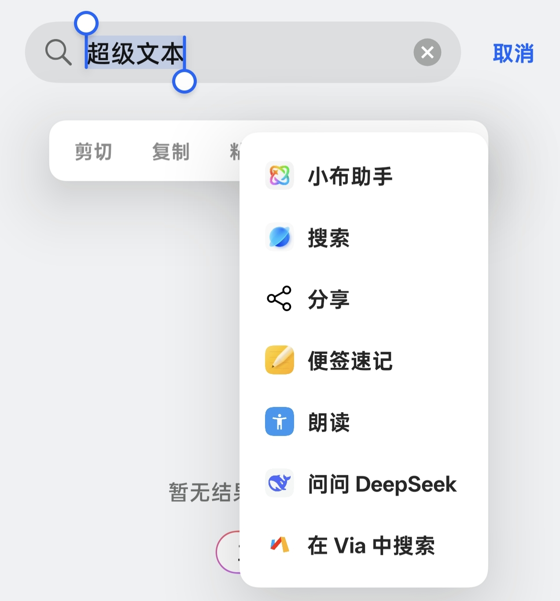
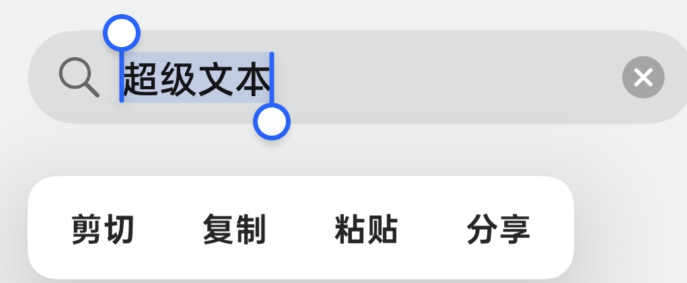

# 文本选择菜单控制

**ColorOS 16 的文字选择菜单控制模块**

当前版本：`v0.6.1`

[下载模块](https://github.com/TheKingBucket001/txtoi/releases/latest) · [源代码](https://github.com/TheKingBucket001/txtoi) · [问题反馈](https://github.com/TheKingBucket001/txtoi/issues)

> LSPosed 镜像仓库。GitHub 源库：[TheKingBucket001/txtoi](https://github.com/TheKingBucket001/txtoi)

---

## 项目简介

长按文字时，菜单里常会堆进一串用不到的“处理文本”项目。文本选择菜单控制把这些项目集中列出：勾选隐藏，拖动调整普通扩展项的顺序，改动自动保存，需要时一键恢复。

模块只处理文字选择菜单中的扩展项，不读取选中文字，也不修改系统 APK 或其他应用。

## 效果对比

<table>
  <tr>
    <td width="32%" align="center" valign="top">
      <strong>未使用模块</strong> 
      处理文本扩展项会展开  
      
    </td>
    <td width="8%" align="center" valign="middle"><strong>&rarr;</strong></td>
    <td width="60%" align="center" valign="top">
      <strong>使用模块后</strong> 
      隐藏不需要的扩展项，只保留系统操作  
      
    </td>
  </tr>
</table>

## 模块功能

- **隐藏与显示**：自动列出手机上的文字处理扩展项。勾选后隐藏，取消勾选即可恢复显示；隐藏的项目仍保留在设置列表中。
- **拖动排序**：拖动左侧手柄调整顺序，松手后自动保存，保存成功会提示“已保存”。已隐藏的项目需要先恢复显示，才能拖动。
- **固定项提示**：固定项与其他选项按顺序显示在同一列表中，不单独置顶。这类选项可以隐藏，但不能拖动；调整排序时会保留它们原来的位置。
- **分别恢复**：“恢复默认排序”保留隐藏设置；“恢复全部显示”保留当前排序。
- **设置保留**：重启手机、更新模块或退出模块应用后，已保存的隐藏和排序设置都会保留。
- **列表操作**：标题和恢复按钮始终可见。列表较长时，拖动到上、下边缘会自动滚动，方便继续调整顺序。
- **启用检查**：打开模块时检查是否已生效、是否获得 Root 授权，未就绪时显示处理提示。
- **更新提醒**：打开模块时可自动检查新版本，也可在关于页关闭这项功能。

## 使用说明

1. 下载并安装 APK。
2. 在 LSPosed 中启用模块，作用域选择 `system`。
3. 重启使模块加载；支持热重启的环境可使用热重启。打开“文本菜单控制”。
4. 在“文本选择菜单”中勾选不想看到的项目；拖动左侧手柄调整可移动项的顺序。
5. 等待“已保存”提示，再重新打开文字选择菜单，检查隐藏与排序效果。

只需 `system` 作用域，无需把每个使用文字菜单的应用加入作用域。隐藏项取消勾选后可移动，系统固定项的位置仍由系统安排。

## 兼容范围

已在 ColorOS 16 / Android 16 验证。扩展项从已安装应用中动态枚举，固定识别调用当前系统的菜单策略；在接口保持兼容时，系统新增固定组件无需更新组件名单。系统内部接口改变时仍可能需要适配，检测不可用的项目可隐藏，但暂停排序。

剪切、复制、粘贴、全选、分享等内置动作由应用现场生成，不属于本模块统一管理的扩展清单。应用自定义菜单或再次重排扩展项时，展示效果可能不同。已打开的菜单需要关闭并重新打开，才能显示最新设置。

## 许可证

本项目采用 [GNU General Public License v3.0](https://github.com/TheKingBucket001/txtoi/blob/main/LICENSE)。
